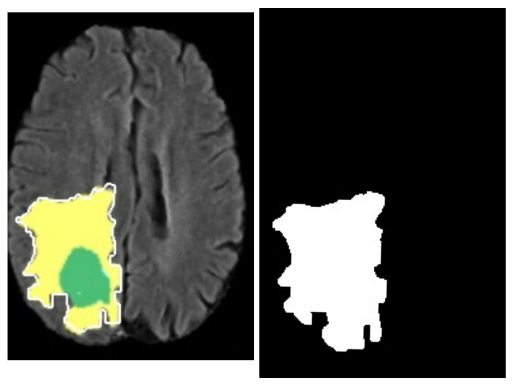
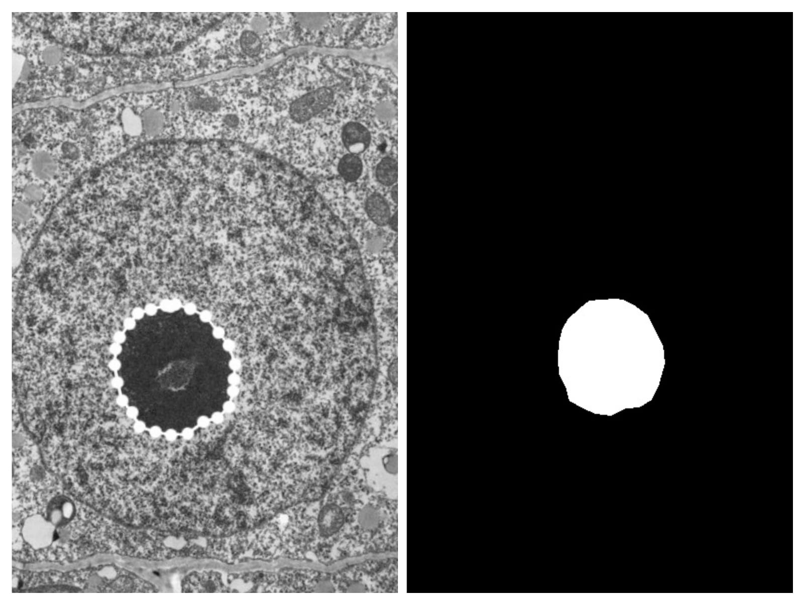
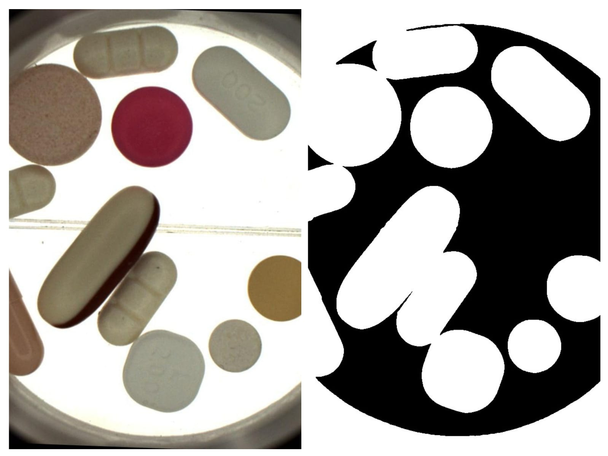
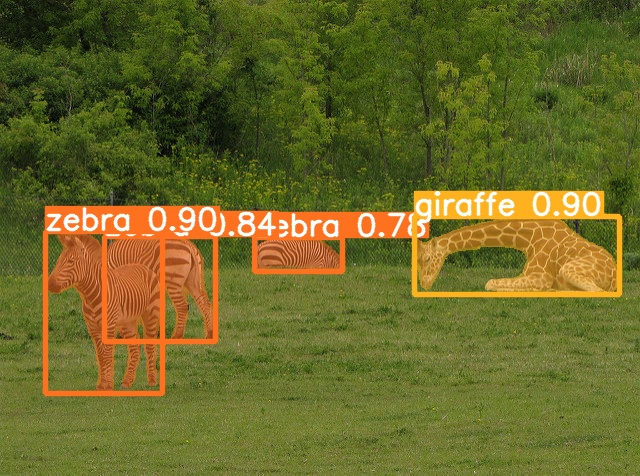
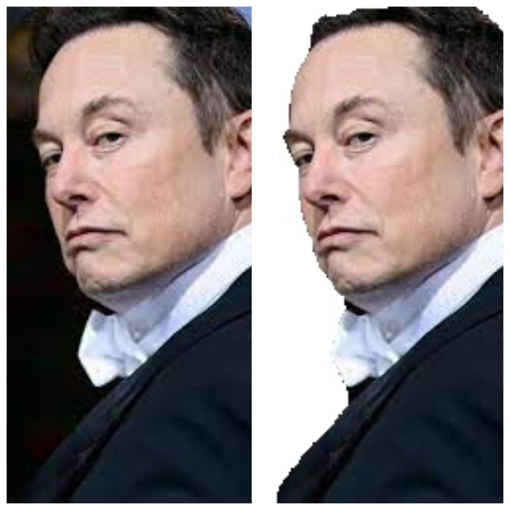
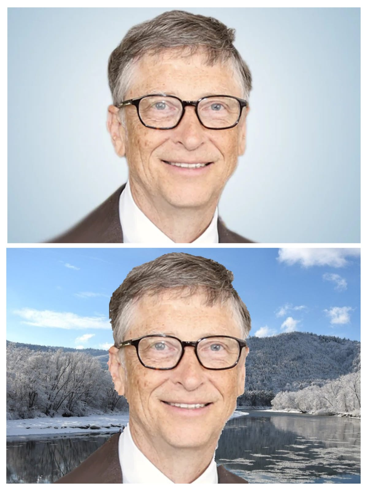

# Manual Data Annotator and Mask Generator

# Description
 An application that will generate a segmentation mask for a given image. The end user drags the mouse pointer and forms a closed loop on the given image. All the pixels in the given loop (along with the boundary) will act as the mask for the given image.
 
 
 
 End user drags the mouse pointer around the desired object to form a loop so that a white mask is generated around it.
 
 
 
 End user can use polylines (by marking points) to form a loop and generate a mask.
 
 # Extended Features
 
## 1. Generating White Masks For All Objects
 
  A white mask is generated around all the objects detected by the model.
  


## 2. Instance Segmentation For All Objects
 
  Model generates a mask along with label and accuracy score for all the detected objects in the image.
  


## 3. Selective Segmentation

End user draws a bounding box and all the objects inside the box are segmented and labelled.


## 4. Background Removal

Background is removed for all the objects whose accuracy score is > 90%



## 5. Background Change

Background is changed for all the objects whose accuracy score is >90%



## 6. Object Detection For Video

Instance segmentation is done for all the objects in the video dynamically

# Installation
Clone the repository:

```git clone https://github.com/Dinesh1102/Manual-Data-Annotator-and-Mask-Generator.git```

Change the current working directory:

```cd Manual-Data-Annotator-and-Mask-Generator-main```

Install the requirements:

```pip install -r requirements.txt```

Run the server:

```python index.py```
