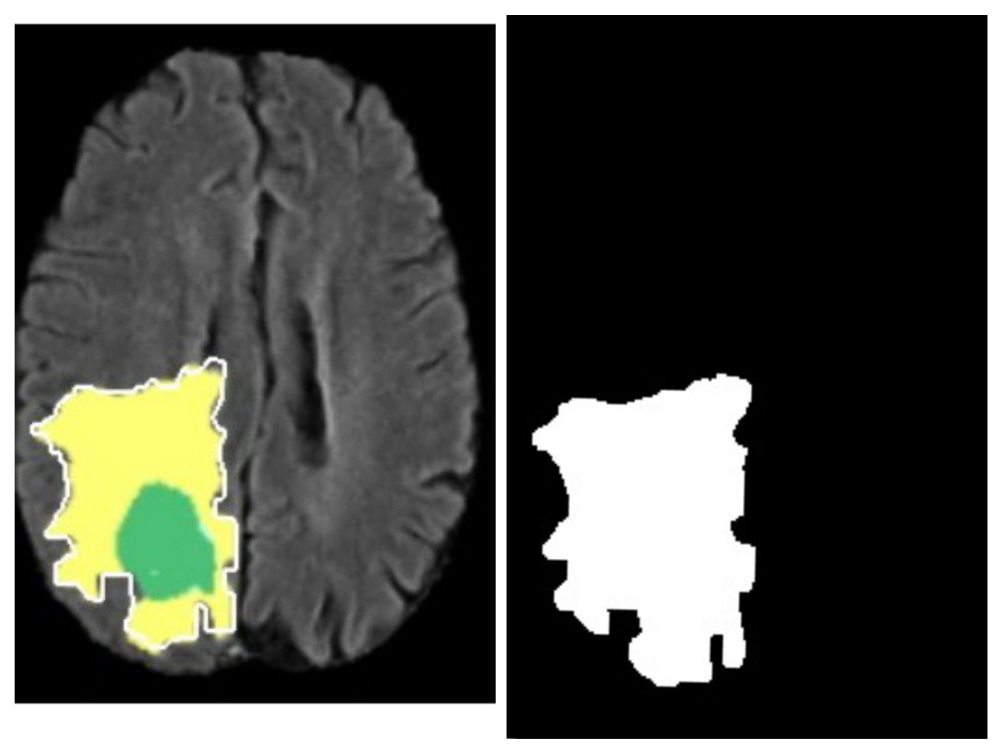

# Manual Data Annotator and Mask Generator

# Description
 An application that will generate a segmentation mask for a given image. The end user drags the mouse pointer and forms a closed loop on the given image. All the pixels in the given loop (along with the boundary) will act as the mask for the given image.
 
 
 End user drags the mouse pointer around the desired object to form a loop so that a white mask is generated around it.
 
 End user can use polylines (by marking points) to form a loop and generate a mask.
 
